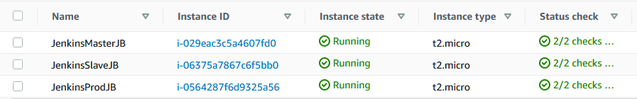
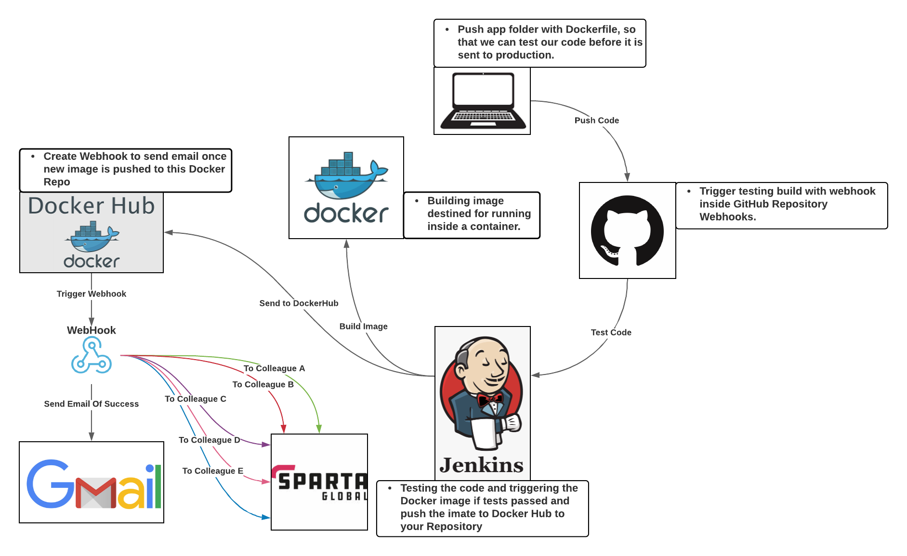

# Instructions of how to setup a CICD End-to-End Pipeline.

By the end of this guide you will be able to integrate, deliver and deploy code to a docker image on the docker hub. **This guide requires access to AWS**.

## Pre-Requisites

1. **3** EC2 (_Elastic Compute Cloud_) instances on AWS.
	* **1**: Jenkins-Master instance.
	* **2**: Jenkins-Slave instance.
	* **3**: Docker Production instance.
2. Set up a Security Group that can be used for all the EC2 Instances.

**Inbound Rules**
	
| **Type**   | **Protocol** | **Port range** | **Source**      | **Description**                  |
|------------|--------------|----------------|-----------------|----------------------------------|
| HTTP       | TCP          | 80             | 0.0.0.0/0       | HTTP Access                      |
| HTTP       | TCP          | 80             | ::/0            | HTTP Access                      |
| Custom TCP | TCP          | 8080           | 0.0.0.0/0       | Jenkins Default Port             |
| Custom TCP | TCP          | 8080           | ::/0            | Jenkins Default Port             |
| SSH        | TCP          | 22             | <your_ipv4>/32  | SSH From your IP                 |
| SSH        | TCP          | 22             | <slave_ipv4>/32 | SSH From Slave Node              |
| Custom TCP | TCP          | 3000           | 0.0.0.0/0       | NodeJS default Port              |
| Custom TCP | TCP          | 3000           | ::/0            | NodeJS default Port              |
| HTTPS      | TCP          | 443            | 0.0.0.0/0       | HTTPS Access                     |
| HTTPS      | TCP          | 443            | ::/0            | HTTPS Access                     |
| Custom TCP | TCP          | 9007           | 0.0.0.0/0       | Allow Slave access  on this Port |
| Custom TCP | TCP          | 9007           | ::/0            | Allow Slave access on this Port  |

**OutBound Rules**

| **Type**    | **Protocol** | **Port range** | **Source** | **Description**       |
|-------------|--------------|----------------|------------|-----------------------|
| All traffic | All          | All            | 0.0.0.0/0  | Allow All Traffic Out |

3. Each Instance must have the same settings:
	* **AMI** : Ubuntu Server 16.04 LTS (HVM) _64-bit (x86)_
	* **Type** : t2.micro
	* **Configure Instance** :
		* **Network** : Your VPC
		* **Subnet** : Public Subnet of your VPC
		* **Public IP** : Enable
	* **Tags** : **Name** : <name_of_instance>
	* **Security Group** : Choose the Security group you created, in previous step.
	* **Add Key** : Choose a key to SSH into instance.

**These are my instances on AWS**



---
**This is a diagram I made to help clarify the End-to-End Lifecycle**



## Creating Jenkins Instance

### Step 1.

First lets set up Jenkins, the first thing we need to do is SSH into the EC2 Instance on AWS that is going to be our Jenkins Server. In my case _**JenkinsMasterJB**_.

```bash
# Make sure you have the private key to ssh with
ssh -i ~/.ssh/DevOpsStudent.pem ubuntu@<ip_of_EM2_Instance>
```

You should now be inside the instance, this is will only work if you have successfully added your own IP to the inbound rules in the security group created earlier.

Now we are going to install Jenkins. To do so follow the below commands, if you encounter any problems then try running the command `apt-get update -y".`

First lets update the ubuntu machines dependencies, using the update command for ubuntu. Then we will install the java development kit.

```bash
# Update your dependencies, and install the correct version of Java JDK
sudo apt-get update -y
sudo apt-get install openjdk-8-jdk
```

Next we need to fetch the Jenkins repo which is handled under debian linux version.

```bash
# Add the Jenkins repo
wget -q -O - https://pkg.jenkins.io/debian/jenkins-ci.org.key | sudo apt-key add
```

Now get the most stable package of Jenkins and also add it to the sources list.

```bash
# Get package of Jenkins most stable version and add to source list.
echo deb https://pkg.jenkins.io/debian-stable binary/ | sudo tee /etc/apt/sources.list.d/jenkins.list

# Update again to fetch the jenkins depdencies and sources
sudo apt-get update
```

Finally install jenkins into the machine.

```bash
# Install jenkins 
sudo apt-get install jenkins -y
```

Now start up the jenkins service so its interface can be accessed in the browser over the machines public IP address.

```bash
# Jenkins service start up
sudo service jenkins start
```

Your Jenkins server should now be available at the ip address of the machine with the port `:8080`. For example `23.234.21.23:8080`.

Now all you need to do is go to the jenkins server and click install suggested plugins, this should install all the essential plugins. Although there a couple more that are needed for this tutorial.

1. **Docker pipeline**
2. **Docker**


___

**This guide is still under construction**


